name:inverse
class: center, middle,inverse
layout: true

---

# HTTPS

Body

---

> HTTPS（全称：Hyper Text Transfer Protocol over Secure Socket Layer），是以安全为目标的 HTTP 通道，简单讲是 HTTP 的安全版。

> HTTPS = HTTP + SSL/TLS

---

# 几个问题

???

带着问题出发

---

- 为什么需要 HTTPS

--

- HTTPS 是如何保证安全的

???

为何不能被劫持

--

- Fiddler/Charles 能抓 https 的包么？

--

- HTTPS 是否 100%安全？

---

# HTTP

???

任何东西的出现及流行，有其必然性。

http 为什么不再满足需求，而出现了 https

超文本传输协议（HTTP，HyperText Transfer Protocol)是互联网上应用最为广泛的一种网络协议。

http 弊端：不安全，等同于裸奔，现在 http 的网站会被浏览器标识为不安全

类似的，我们常用来接收的短信验证码，如果是用的 2G 或 3G 网络，那么也完全是裸奔的。
而 4G 的 TD-LTE FDD-LTE 是比较安全的

当然，目前是有技术手段可以让支持 4G 的手机降级的

---

# HTTP 劫持

---

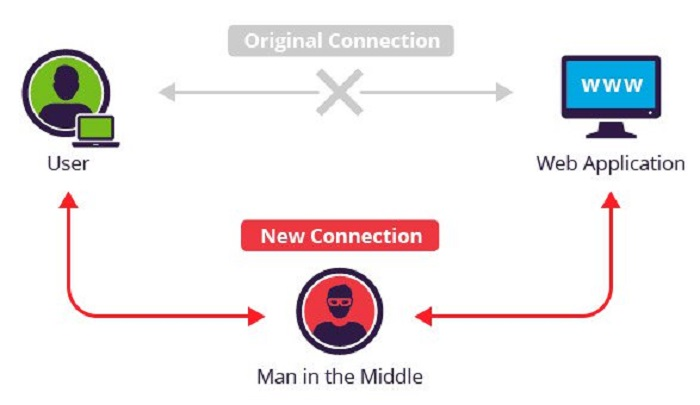

???

如果让你来改进 http 协议，如何让其变安全？

---

# 加密

---

- 对称加密

--

- 非对称加密

???

编码不是加密： base64(浏览器演示 btoa 函数)

散列/hash 也不是加密：[md5](https://md5jiami.51240.com/)、SHA 家族

对称加密：AES、DES、3DES 速度快、密钥唯一

非对称加密：RSA 速度慢、有一对密钥，加密用一个密钥，解密用另一个密钥

散列有点类似于取特征值，比如我们描述一个人：叫张三、身高 1.8，年龄 20，此可以作为对张三的一个描述，但并不能反过来唯一确定张三。

又比如我们用 4 6 两个数，我们取 24 为其特征值， 但对于一个拿到 24 的人，无法知道我们是通过 1x24 还是 2x12 还是 3x8 还是 4x6 得到的 24

---

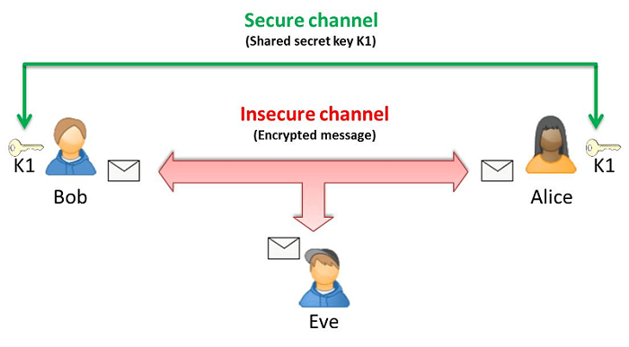

???

对称加密很方便，速度也很快，但由于密钥唯一，安全性得不到保障

[《模仿游戏》](https://movie.douban.com/subject/10463953/)

图灵：图灵测试、图灵机、图灵奖（计算机界的诺贝尔奖）、计算机之父、人工智能之父

---

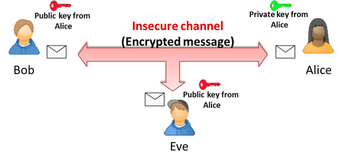

???

非对称加密有利于单向通信及签名。

1. 公钥加密的信息，只有私钥可以解，中间人无法查看
2. 私钥加密的信息，所有人都可以通过公钥解，但无法伪造

---

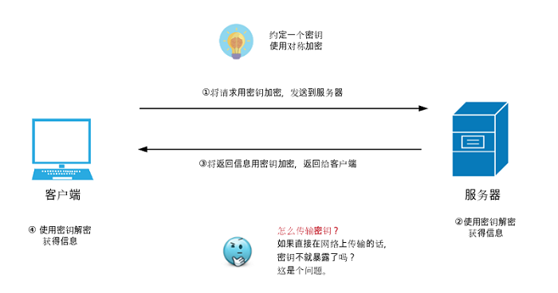

???

[大图](https://user-images.githubusercontent.com/8401872/28902322-c1ac4bdc-7830-11e7-88d7-0da60428cd19.png)

---

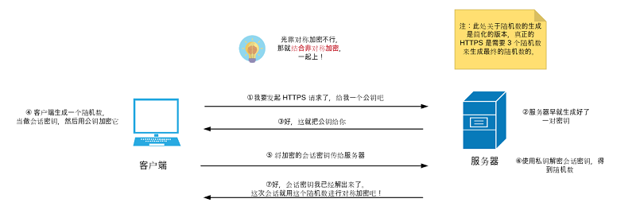

???

[大图](https://user-images.githubusercontent.com/8401872/28902323-c1b60708-7830-11e7-8280-03d2bb80b370.png)

---

# 中间人攻击

---

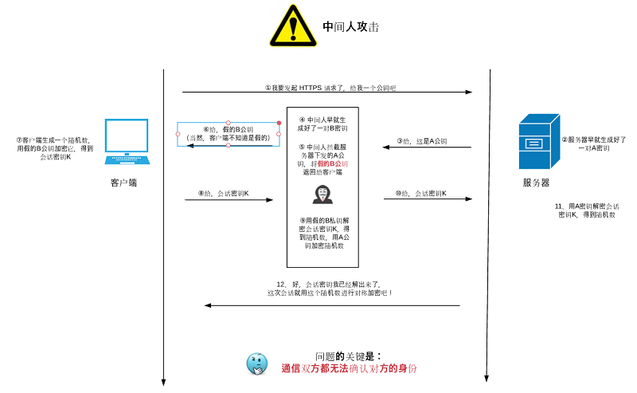

???

[大图](https://user-images.githubusercontent.com/8401872/28902455-8afb96b4-7831-11e7-9a53-2c8474a963af.png)

---

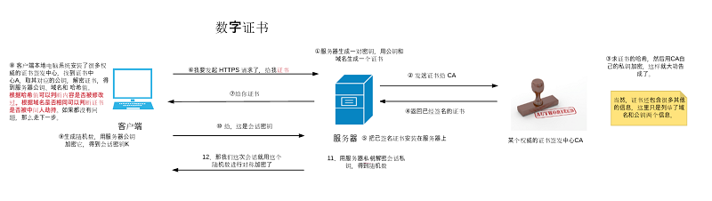

???

公钥放在数字证书中

[大图](./images/ca1.png)

---

数字签名

???

数字签名是什么？为什么可以证明服务器身份？

---

> 政府有一对公钥与私钥，现在先对姓名、性别、年龄、住址、签发单位、证件有效期、公钥做一次 hash，然后使用私钥对该 hash 值做一次加密得到最后一项签名

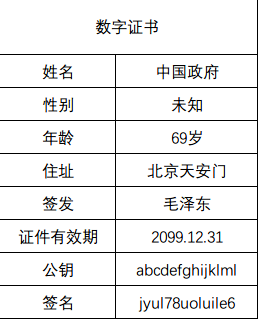

???

政府签了这张证书给你，你能信任这个证书是中国政府签的么？

国家政府的证书必须无条件被任何国家信任，国家的信誉做保障，离线保存私钥

---

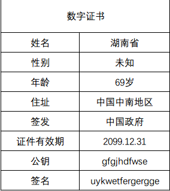

???

这个签名是由国家私钥加密得来，叫中间证书

---

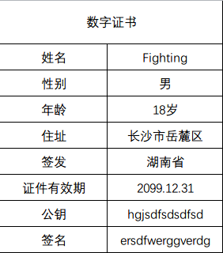

???

这个签名是由湖南省私钥加密得来

---

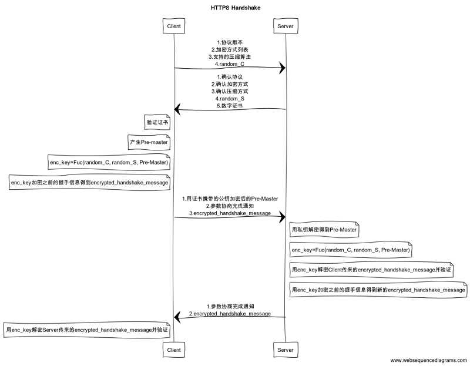
???

[大图](./images/handshake1.png)

这个握手过程是否安全？

时序图源码

```
title HTTPS Handshake

Client->Server: 1.协议版本\n2.加密方式列表\n3.支持的压缩算法\n4.random_C
Server->Client: 1.确认协议\n2.确认加密方式\n3.确认压缩方式\n4.random_S\n5.数字证书
note left of Client: 验证证书
note left of Client: 产生 Pre-master
note left of Client: enc_key=Fuc(random_C, random_S, Pre-Master)
note left of Client: enc_key 加密之前的握手信息得到 encrypted_handshake_message
Client->Server: 1.用证书携带的公钥加密后的 Pre-Master \n2.参数协商完成通知\n3.encrypted_handshake_message
note right of Server: 用私钥解密得到 Pre-Master
note right of Server: enc_key=Fuc(random_C, random_S, Pre-Master)
note right of Server: 用 enc_key 解密 Client 传来的 encrypted_handshake_message 并验证
note right of Server: 用 enc_key 加密之前的握手信息得到新的 encrypted_handshake_message
Server->Client: 1.参数协商完成通知\n2.encrypted_handshake_message
note left of Client: 用 enc_key 解密 Server 传来的 encrypted_handshake_message 并验证
```

https://www.websequencediagrams.com/

---

如何抓包 HTTPS

???

我们经常用 Fiddler 抓包，那么它是如何抓取 https 包的呢？

---

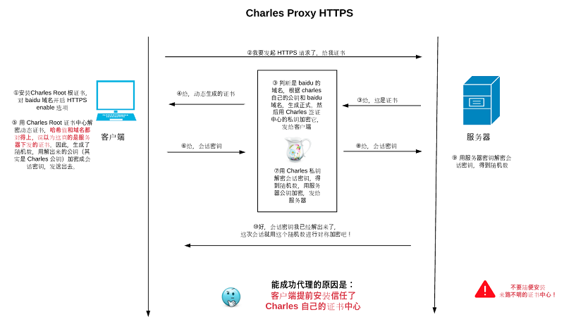

???

演示浏览器里面的证书

[大图](./images/proxy1.png)

- cnnic 根证书被吊销 [月光博客](http://www.williamlong.info/archives/4192.html)
- github 被劫持事件 （wosign 证书被吊销一段时间）

- 12306 的自签证书

---

证书类型

---

DV、OV、EV

???

[腾讯云](https://cloud.tencent.com/product/ssl)

证书本身的制作成本为 0，你自己生成证书，给它签个名而已，但 ov、ev 的收费为什么这么高昂？

1. 信用担保、保险、法律开销
2. 浏览器、系统对植入根证书需要收费
3. webTrust 年度审计
4. .....

---

全站升级 https 就固若金汤了吗？

???

---

SSLstrip

---

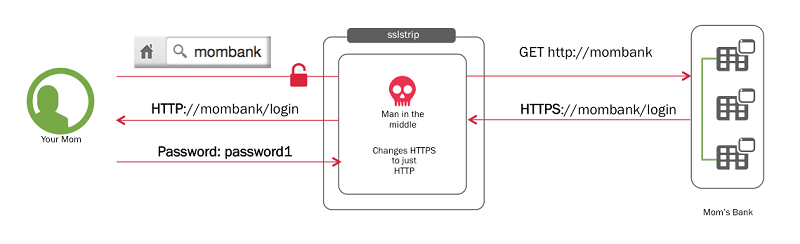

???

[大图](./images/sslstrip1.png)

通过 SSLstrip 强制使 https 降级为 http

---

# HSTS

???

之前有解决方案：js 检测当前是否 https，不是则通过 location 跳转到 https，但敌不过别人直接给你把代码替换掉

Strict-Transport-Security: max-age=31536000

添加到 HSTS 列表 https://hstspreload.org/ google 维护

[HTTP Strict Transport Security](https://developer.mozilla.org/zh-CN/docs/Security/HTTP_Strict_Transport_Security)

## 本地添加测试 chrome://net-internals/#hsts

---

我们的网站应不应该使用 HTTPS？

???

答案是毋庸置疑的：

1. 正确部署完 HTTPS，配置 HSTS 以后，通信安全是可以得到极大保障的
2. RSA 的破解，以现在的技术很难
3. 相信 CA 机构的节操

---

```
  console.log("Thanks!");
```
